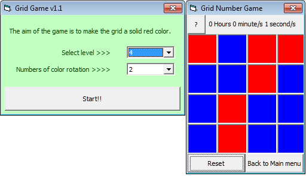



## Grid Color Game v1\.1

### Description

Grid Color Game ver 1.1

The goal of the game is to make the grid a solid red by clicking on a certain "cell" to switch the color from red to blue and vice-versa, but the twist is all adjacent cell will also switch color thus making the puzzle difficult.

ver 1.1 update

- made the puzzle color based

- able to select the size of the grid from 3x3 to 5x5.

- able to select the difficulty of the puzzle by selecting the number of color rotation.

Special thanks to Paul Bahlawan and Roger Gilchrist for giving me such a great advice on optimizing the code.
 
### More Info
 

             |
---                |---
**Submitted On**   |2011-02-16 09:52:36
**By**             |[Ernanie F\. Gregorio Jr\.](https://github.com/Planet-Source-Code/PSCIndex/blob/master/ByAuthor/ernanie-f-gregorio-jr.md)
**Level**          |Beginner
**User Rating**    |5.0 (10 globes from 2 users)
**Compatibility**  |VB 6\.0
**Category**       |[Games](https://github.com/Planet-Source-Code/PSCIndex/blob/master/ByCategory/games__1-38.md)
**World**          |[Visual Basic](https://github.com/Planet-Source-Code/PSCIndex/blob/master/ByWorld/visual-basic.md)
**Archive File**   |[Grid\_Color2198482212011\.zip](https://github.com/Planet-Source-Code/ernanie-f-gregorio-jr-grid-color-game-v1-1__1-73758/archive/master.zip)

